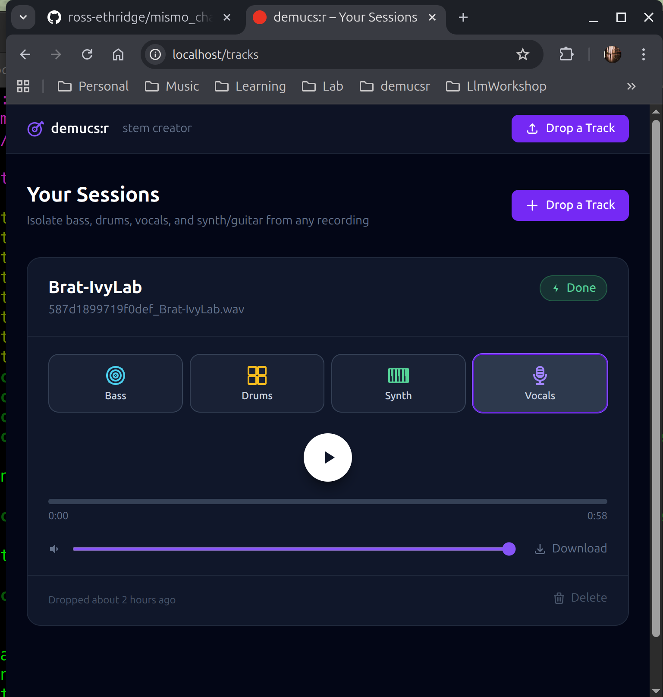

# demucs:r

A self-hosted web app for splitting any song into its individual stems — bass, drums, vocals, and synth/guitar — powered by Meta's [Demucs](https://github.com/adefossez/demucs) AI model.

Upload a track, wait a few minutes, download your stems as WAV files. Runs entirely on your own infrastructure.



---

## How it works

Demucs uses a hybrid transformer neural network trained on thousands of songs to separate a mixed audio track into four isolated stems:

| Stem | Contains |
| --- | --- |
| **Vocals** | Lead and backing vocals |
| **Bass** | Bass guitar, sub bass |
| **Drums** | Kick, snare, hi-hats, cymbals |
| **Other** | Synths, guitars, keys, everything else |

After separation, each stem is automatically post-processed:

- **Silence removal** — gaps longer than 1 second below -40dB are stripped out, removing the near-silence bleed that source separation models produce between musical phrases
- **Dynamic normalization** — `dynaudnorm` levels out the volume across each stem so quiet sections aren't buried next to loud ones
- **Lossless output** — stems are written as 32-bit float WAV (`pcm_f32le`), the same format Demucs produces internally, with no quality loss

The model used is `htdemucs_ft` — the fine-tuned version of Demucs, which produces the highest quality results.

---

## Architecture

The app runs as a set of Kubernetes workloads:

| Pod | Role |
| --- | --- |
| **web** | Rails app served by Thruster (handles TLS, HTTP/2) |
| **worker** | Solid Queue job runner — submits tracks to the demucs service |
| **demucs** | Long-running Python HTTP service — runs the AI model, uploads stems to MinIO |
| **postgres** | Database for Rails |
| **minio** | S3-compatible object store for audio files and stems |

Rails is purely a UI layer. All audio processing happens in the demucs pod. Files move between services via MinIO — the worker tells the demucs pod where to find the input and where to write the output, and the demucs pod handles the rest.

---

## Requirements

- A [k3s](https://k3s.io/) node (single-node is fine)
- 6+ CPU cores and 16+ GB RAM recommended
- ~15 GB disk space for images and model checkpoints
- A domain name pointed at the node (Thruster handles TLS via Let's Encrypt)

---

## Deployment

### 1. Clone the repo

```bash
git clone https://github.com/ross-ethridge/demucs.git
cd demucs
```

### 2. Build and push images

Images are hosted on GHCR. `k8s/kustomization.yaml` is not committed — copy the example and set your registry:

```bash
cp k8s/kustomization.yaml.example k8s/kustomization.yaml
# edit k8s/kustomization.yaml and replace your-github-username
```

```bash
docker build -t ghcr.io/your-github-username/demucs-web:latest ./web
docker build -t ghcr.io/your-github-username/demucs:latest .

docker push ghcr.io/your-github-username/demucs-web:latest
docker push ghcr.io/your-github-username/demucs:latest
```

The demucs image downloads model checkpoints during build. Allow 20–30 minutes on first build.

Create a GHCR pull secret so k3s can pull the images:

```bash
kubectl -n demucs create secret docker-registry ghcr-pull-secret \
  --docker-server=ghcr.io \
  --docker-username=your-github-username \
  --docker-password=<github-pat>
```

### 3. Create the namespace

```bash
kubectl apply -f k8s/namespace.yaml
```

### 4. Create the secret

```bash
kubectl -n demucs create secret generic demucs-secrets \
  --from-literal=POSTGRES_USER=demucs \
  --from-literal=POSTGRES_PASSWORD=$(openssl rand -hex 16) \
  --from-literal=AWS_ACCESS_KEY_ID=$(openssl rand -hex 16) \
  --from-literal=AWS_SECRET_ACCESS_KEY=$(openssl rand -hex 32) \
  --from-literal=AWS_REGION=us-east-1 \
  --from-literal=AWS_BUCKET=demucs \
  --from-literal=SECRET_KEY_BASE=$(openssl rand -hex 64) \
  --from-literal=TLS_DOMAIN=your.domain.com
```

Replace `your.domain.com` with your domain. Thruster will obtain a TLS certificate automatically via Let's Encrypt.

### 5. Create host directories for MinIO storage

```bash
sudo mkdir -p /mnt/minio-data
```

### 6. Deploy

```bash
kubectl apply -k k8s/
```

### 7. Verify

```bash
kubectl get all -n demucs
```

All pods should reach `1/1 Running`. The `minio-init` job will complete once and then show `Completed`.

---

## User management

The app requires a login. Accounts are managed via Rake tasks — there is no self-signup UI.

```bash
# Create a user (generates a random password)
kubectl -n demucs exec deploy/web -- rails users:create EMAIL=you@example.com

# List all users
kubectl -n demucs exec deploy/web -- rails users:list

# Delete a user
kubectl -n demucs exec deploy/web -- rails users:delete EMAIL=you@example.com

# Reset a user's password to a new generated one
kubectl -n demucs exec deploy/web -- rails users:reset EMAIL=you@example.com
```

`users:create` and `users:reset` both print the generated password to stdout. Users can change their password after logging in via the **Change password** link in the nav.

---

## Configuration

Tuning parameters are set directly in the manifests:

| Setting | Manifest | Default | Description |
| --- | --- | --- | --- |
| `OMP_NUM_THREADS` | `k8s/demucs.yaml` | `6` | PyTorch CPU threads — set to physical core count |
| `MKL_NUM_THREADS` | `k8s/demucs.yaml` | `6` | Intel MKL threads — keep in sync with above |
| `DEMUCS_SHIFTS` | `k8s/worker.yaml` | `3` | Prediction passes — higher is slower but better quality |
| `JOB_CONCURRENCY` | `k8s/worker.yaml` | `2` | Solid Queue worker threads |

After changing any manifest value:

```bash
kubectl apply -k k8s/
```

---

## Processing time

Processing time depends on track length, CPU speed, and `DEMUCS_SHIFTS`:

| Shifts | Quality | Time (6-core CPU) |
| --- | --- | --- |
| `1` | Good | ~2–3 min |
| `3` | Better | ~6–9 min |
| `5` | Best | ~10–15 min |

With an Nvidia GPU, all of the above take under a minute. The demucs image includes CUDA 11.8 wheels. GPU support is not yet wired into the k8s deployment.

---

## Operations

```bash
# View logs
kubectl -n demucs logs -f deployment/web
kubectl -n demucs logs -f deployment/worker
kubectl -n demucs logs -f deployment/demucs

# Restart a pod
kubectl -n demucs rollout restart deployment/demucs

# Scale worker concurrency (edit JOB_CONCURRENCY in k8s/worker.yaml, then)
kubectl apply -k k8s/

# Access MinIO console (port-forward since it's not exposed publicly)
kubectl -n demucs port-forward svc/minio 9001:9001
# Then browse to http://localhost:9001
# Credentials are the AWS_ACCESS_KEY_ID / AWS_SECRET_ACCESS_KEY from your secret
```

---

## License

MIT — see [LICENSE](LICENSE).

Demucs is developed by Meta Research and released under the MIT license. See the [Demucs repository](https://github.com/adefossez/demucs) for details.
